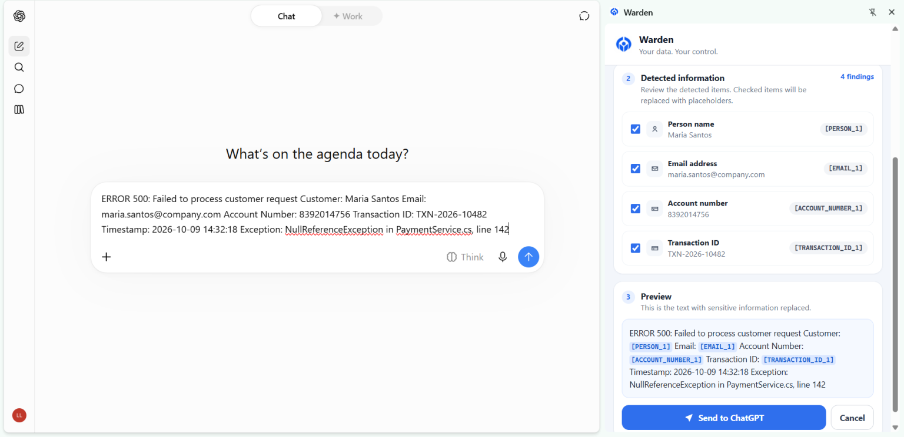
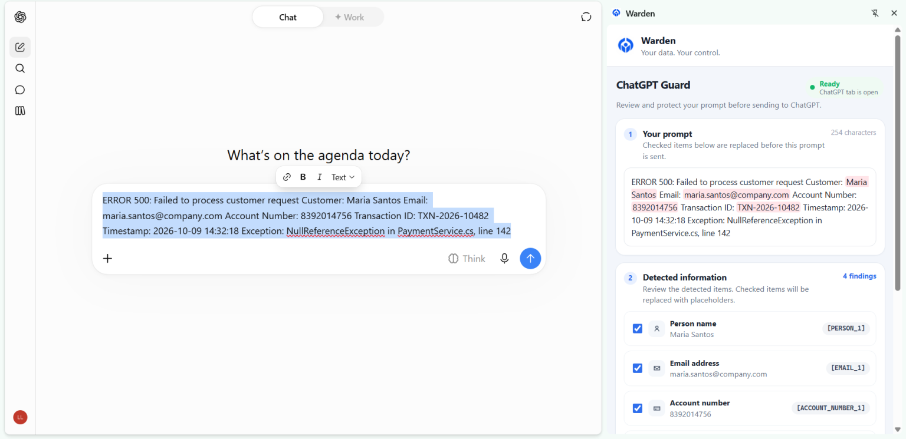
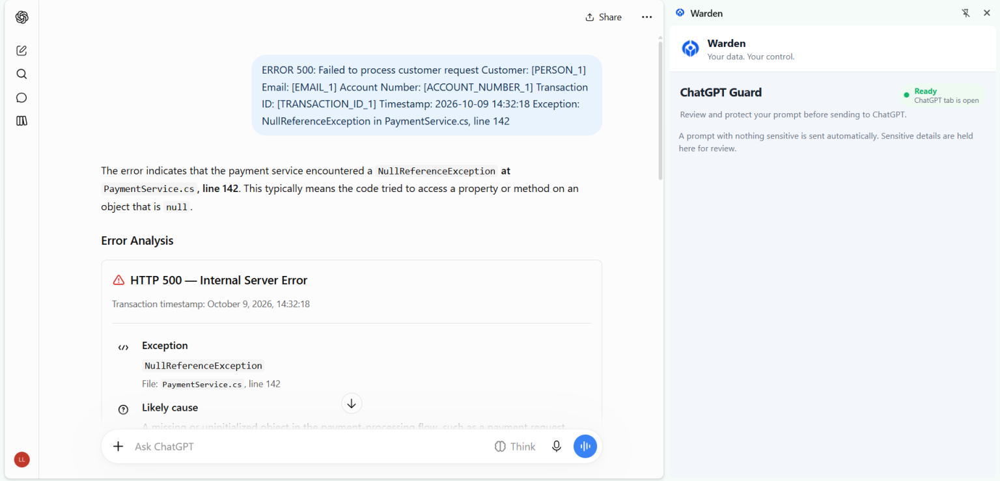
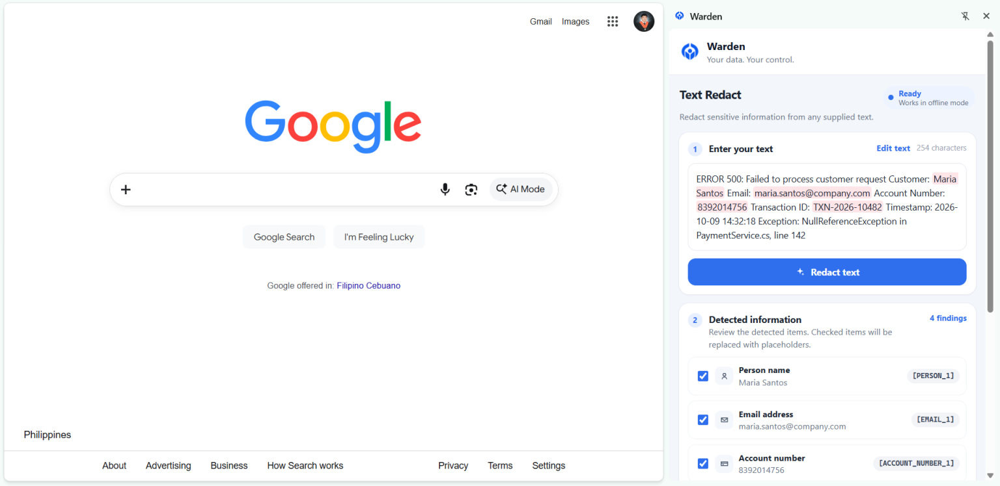
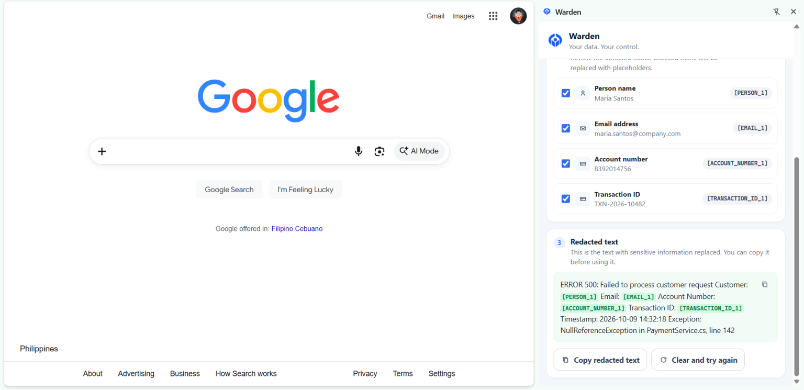

<p align="center">
  
</p>

<h1 align="center">Warden</h1>

<p align="center"><b>Your data. Your control.</b></p>

<p align="center">
  A privacy-first Chrome extension that catches personal information in your ChatGPT prompts and masks it <i>before</i> it leaves your computer, using an AI model that runs entirely on your own machine.
</p>

---

## Overview

Warden is a privacy-focused Chrome extension that detects and masks personally identifiable information (PII) in ChatGPT prompts before they are submitted. It processes data locally and replaces sensitive details with placeholders such as `[PERSON_1]` and `[EMAIL_1]`, so you lower the risk of exposing personal information while your prompt stays useful. It also works offline, so you can clean up and prepare text with no internet connection. With automatic masking and a review step, Warden puts privacy and control back in your hands.

<p align="center">
  
</p>

## Features

### 🛡️ ChatGPT Guard: stops leaks before they happen

When you press **Send** (or **Enter**) on chatgpt.com, Warden holds the prompt and scans it on your machine.

- **Nothing sensitive?** The prompt is sent right away. You won't notice Warden.
- **Something sensitive?** The Warden side panel opens and the prompt waits for you to review it.

| Your prompt, with sensitive parts highlighted | Detected items and a redacted preview |
| :---: | :---: |
|  |  |

Click **Send to ChatGPT** and Warden swaps your prompt for the redacted version, then sends it. ChatGPT only sees the placeholders, and it can still fully help with the actual problem:

<p align="center">
  
</p>

### ✂️ Text Redact: works on any page, even offline

On any tab other than ChatGPT, the side panel becomes **Text Redact**. Paste any text, such as a log, an email, or a support ticket, and Warden flags the sensitive parts, lets you pick what to mask, and gives you clean text to copy. Detection runs entirely on your machine, so this works fully offline.

| Paste and detect | Copy the redacted result |
| :---: | :---: |
|  |  |

### ✅ You stay in control

- **Review before sending:** every finding has a checkbox. Untick anything you want to keep as-is.
- **Live preview:** see exactly what will be sent before it is sent.
- **Consistent placeholders:** the same value always gets the same token, so `[PERSON_1]` means the same person everywhere in the prompt and the AI can still follow the context.
- **Clear status:** a status badge shows whether the local model is ready, missing, or offline.

### 🔍 What Warden detects

All detection runs locally. Warden flags common identifiers such as emails, phone numbers, card and account numbers, transaction IDs, government IDs, passwords and API keys, IP addresses, and street addresses. Its local AI model also catches context-dependent PII, such as names in free text, ages, marital status, gender, and race or ethnicity.

## The AI model

Warden uses **[Distil-PII Llama 3.2 3B Instruct](https://huggingface.co/mradermacher/Distil-PII-Llama-3.2-3B-Instruct-GGUF)** (GGUF, `Q4_K_M` quantization):

```
hf.co/mradermacher/Distil-PII-Llama-3.2-3B-Instruct-GGUF:Q4_K_M
```

It is a small Llama 3.2 model (3B parameters) trained specifically to find and redact PII in text. Warden gives it your prompt and gets back each sensitive value, the type of information it is, and why it was flagged. This is the context-aware layer: it can tell that "Maria" in *"my coworker Maria is going through a divorce"* is a person, which a regex can't.

The model runs **locally through [Ollama](https://ollama.com)** on `http://127.0.0.1:11434`. The 4-bit `Q4_K_M` build is about 2 GB, so it runs on an ordinary laptop, with or without a GPU.

### Where we ran the model

We developed and tested Warden with the model running on a mid-range laptop:

| Component | Spec |
| --- | --- |
| Laptop | Lenovo (model 82NL) |
| OS | Windows 10 Pro 64-bit (build 19045) |
| CPU | Intel Core i5-10500H @ 2.50 GHz (6 cores, 12 threads) |
| RAM | 16 GB |
| GPU | NVIDIA GeForce RTX 3050 Ti Laptop GPU (4 GB VRAM) |

The ~2 GB model fits within the GPU's 4 GB of VRAM, so no high-end hardware is needed.

## Why does this product benefit from running AI locally?

To find PII, the AI has to read your raw, unmasked prompt. If that AI ran in the cloud, your sensitive data would be sent to a third party just to check whether it is safe to send. Running it locally avoids that:

- **Your data never leaves your device.** Only the redacted prompt you approve ever reaches the internet.
- **Can also work offline for other use cases.** With Text Redact, you can clean up logs, emails, or support tickets without an internet connection, before sharing them anywhere.

## Getting started

Warden's AI runs locally and offline. Follow these steps in order.

### Requirements

- Windows 10/11
- Google Chrome (or another Chromium browser that supports side panels)
- [Node.js](https://nodejs.org) 20 or newer
- [Ollama](https://ollama.com)
- About 3 GB of free disk space (the model is roughly 2 GB)
- An internet connection for the one-time model download only. After that, the model runs offline.

### 1. Start Ollama with the launcher

Run [`backend/repos/OllamaLauncher/dist/OllamaLauncher.exe`](backend/repos/OllamaLauncher/dist/OllamaLauncher.exe).

The launcher:

- starts the Ollama server in the background if it isn't already running,
- registers itself to start every time you log in (for all users if run as administrator, otherwise only for you), so you normally only need to run it once,
- preloads the Distil-PII model and keeps it in memory for 30 minutes, so your first scan doesn't wait for the model to load.

Check that the server is up:

```bash
ollama list
```

If this prints a table (possibly empty) without a connection error, you're good.

To remove the launcher from startup, run `OllamaLauncher.exe --uninstall`.

### 2. Download the model

In Command Prompt or PowerShell, run:

```bash
ollama pull hf.co/mradermacher/Distil-PII-Llama-3.2-3B-Instruct-GGUF:Q4_K_M
```

Wait for the download to finish (about 2 GB).

### 3. Test the model

```bash
ollama run hf.co/mradermacher/Distil-PII-Llama-3.2-3B-Instruct-GGUF:Q4_K_M
```

Type a prompt. If the model replies, the setup is complete. Exit with `/bye`.

Warden connects to Ollama's local API at `http://localhost:11434` with this model name automatically. Nothing needs to be configured.

### 4. Build the extension

```bash
cd frontend
npm install
npm run build
```

### 5. Load it in Chrome

1. Open `chrome://extensions`.
2. Turn on **Developer mode**.
3. Click **Load unpacked** and select `frontend/dist`.
4. Refresh any open ChatGPT tabs.

### Troubleshooting

| Problem | Fix |
| --- | --- |
| `ollama pull` says it can't connect | Run `OllamaLauncher.exe` first, then try again. |
| `ollama` is not recognized | Reinstall Ollama, or restart the terminal so `PATH` updates. |
| The download is slow or fails | Check your internet connection and rerun the same `ollama pull` command. It resumes where it left off. |
| Port 11434 is already in use | Ollama is already running. Skip step 1. |

## How it works

```
 ChatGPT page                      Warden extension                     Your machine
┌──────────────┐  hold prompt   ┌──────────────────────┐   localhost   ┌──────────────┐
│ Send / Enter │ ─────────────▶ │ Local PII scan       │ ────────────▶ │ Ollama       │
│              │                │ with AI model        │ ◀──────────── │ Distil-PII   │
│              │ ◀───────────── │ Review in side panel │               └──────────────┘
└──────────────┘ redacted text  └──────────────────────┘
        │
        ▼
   chatgpt.com  (only ever receives the redacted prompt)
```

| Path | Purpose |
| --- | --- |
| `frontend/public/page-hook.js` | Runs inside ChatGPT. Intercepts Send and Enter, holds the prompt, then writes and sends the approved text. |
| `frontend/public/page-bridge.js` | Connects the page to the extension and shows the "Checking prompt" indicator. |
| `frontend/src/background.ts` | Service worker. Runs scans, opens the side panel, and returns the final prompt to the page. |
| `frontend/src/localScan.ts` | Local detection, merging findings, and placeholder assignment. |
| `frontend/src/api.ts` | Talks to the local Ollama server: health check and the AI scan. |
| `frontend/src/components/` | Side panel UI: ChatGPT Guard, Text Redact, and shared review components. |
| `backend/repos/OllamaLauncher/` | Windows helper that starts Ollama at login and preloads the model. |

See [`frontend/README.md`](frontend/README.md) for more developer detail.

## Limitations

- On CPU-only machines, the AI check can take 30–60 seconds. It times out after 120 seconds, and Warden still shows everything else it found.
- Some numbers, such as account numbers, are only flagged when labelled (for example `Account Number: 8392014756`), so order numbers and quantities aren't flagged by mistake.
- Detection is a safety net, not a guarantee. Always check the preview before sending.

## Tech stack

- **Extension:** TypeScript, React 19, Vite 7 + CRXJS, Chrome Manifest V3 (side panel API)
- **Local AI:** Ollama + Distil-PII Llama 3.2 3B Instruct (GGUF, Q4_K_M)
- **Launcher:** .NET 8 (C#) background app for Windows
